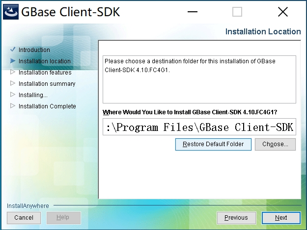
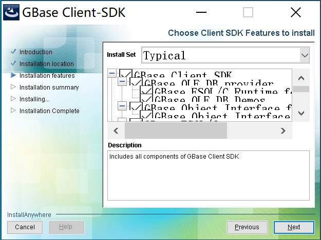
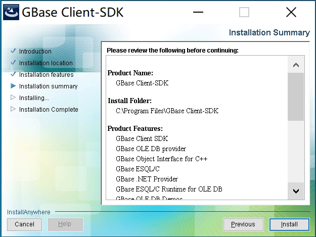
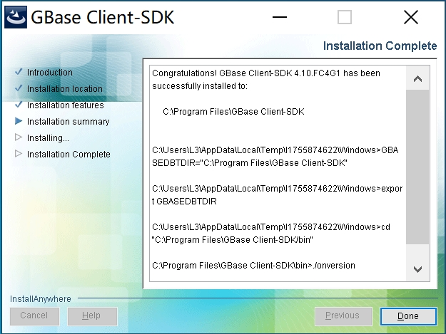
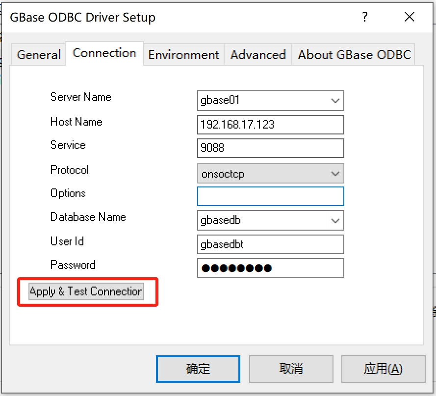
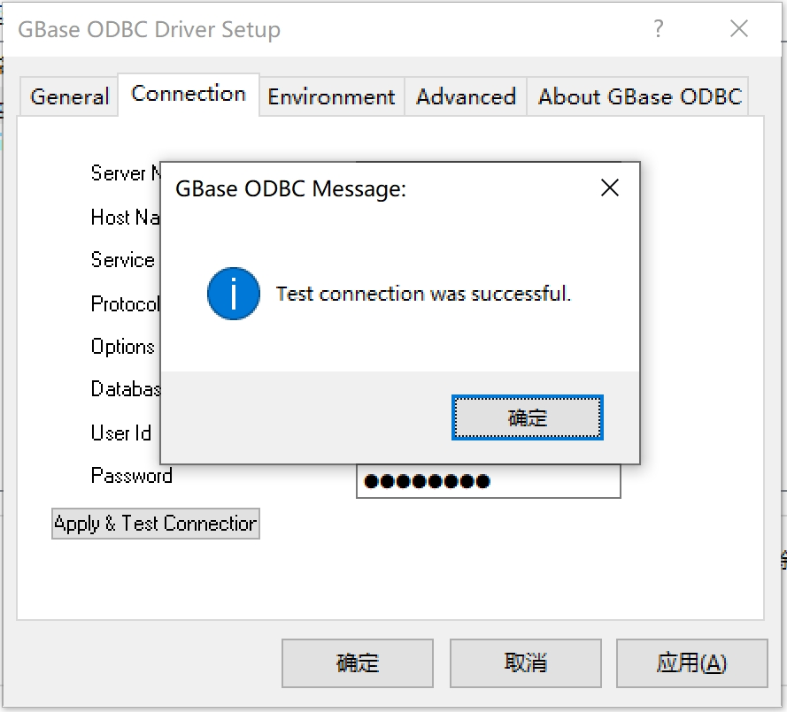

## LINUX安装CSDK及配置ODBC
### 安装CSDK
下载【[GBASE 8S CSDK LINUX X86_64最新版](https://www.dbboys.com/dl/gbase8s/csdk/x86/latest.tar)】【[GBASE 8S CSDK LINUX ARM最新版](https://www.dbboys.com/dl/gbase8s/csdk/arm/latest.tar)】    

【root】用户执行：解压
```
tar -xvf clientsdk_3.6.3_3X2_1_783c8d_RHEL6_x86_64.tar
```
【root】用户执行：静默安装
```
./installclientsdk -i silent -DLICENSE_ACCEPTED=TRUE -DUSER_INSTALL_DIR=/opt/gbase
```
配置CSDK环境变量，【应用用户】执行：
```
export GBASEDBTDIR=/opt/gbase  
export PATH=$PATH:$GBASEDBTDIR/bin
```
配置sqlhosts文件，【应用用户】执行：（sqlhosts文件填写需要连接的远端实例信息)
```
cat <<! >$GBASEDBTDIR/etc/sqlhosts  
gbase01 onsoctcp 192.168.17.101 9088  
!
```

### 安装及配置UnixODBC
【root】用户执行：
```
yum install unixODBC
```
配置运行程序用户环境变量，【应用用户】执行：
```
export LD_LIBRARY_PATH=${GBASEDBTDIR}/lib:${GBASEDBTDIR}/lib/esql:${GBASEDBTDIR}/lib/cli:$LD_LIBRARY_PATH 
export ODBCINI=$GBASEDBTDIR/etc/odbc.ini 
```
配置ODBC配置文件，【应用用户】执行：
```
cat <<! >$ODBCINI
[ODBC Data Sources]  
odbc_demo=GBase 8s ODBC DRIVER  
[odbc_demo]  
Driver=/opt/gbase/lib/cli/iclit09b.so  
Description=GBase 8s ODBC DRIVER  
Database=testdb  
LogonID=gbasedbt  
pwd=GBase123  
Servername=gbase01  
CLIENT_LOCALE=zh_cn.utf8  
DB_LOCALE=zh_cn.utf8  
!
```
测试ODBC连接，【应用用户】执行：
```
isql -v odbc_demo
```
出现以下输出表示连接正常，可执行sql语句：
```
[root@dbhost1 ~]# isql -v odbc_demo
+---------------------------------------+
| Connected!                            |
|                                       |
| sql-statement                         |
| help [tablename]                      |
| quit                                  |
|                                       |
+---------------------------------------+
SQL> 
```
## WINDOWS安装CSDK及配置ODBC
下载【[GBASE 8S CSDK WINDOWS最新版](https://www.dbboys.com/dl/gbase8s/csdk/win/latest.zip)】  
### 安装CSDK
解压后双击【installclientsdk.exe】 







### 配置ODBC
【控制面板】-【系统和安全】-【管理工具】-【ODBC数据源(64位)】-【系统DNS】-【添加】


```
Server Name：实例名  
Host Name：IP地址  
Service：端口  
Protocol：onsoctcp  
Options：不填  
User Id：用户名  
Password：密码  
```

```
Client Locale：zh_cn.utf8  
Database Locale:zh_cn.utf8  
如果不是utf8字符集，可能为zh_cn.gb18030-2000
```


